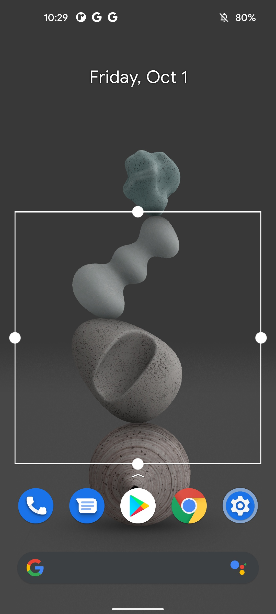

# SingleTapToLock

**Create a transparent widget and tap on it to lock the phone**

Not all launchers support double tap to lock. This is a workaround.

## How to build

**Hidden apis are needed while you need to sign this app with platform key or it won't work. Thus you need to build it as an AOSP module.**

- Clone your ROM source
- Clone this repo into `packages/apps`
- `. build/envsetup.sh`
- `lunch <your device>`
- `mmm packages/apps/SingleTapToLock`
- Get apk at `out/target/product/<product name>/system_ext/app/SingleTapToLock`

## License

- Apache 2.0